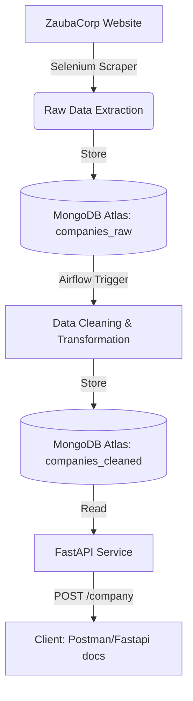

# ⚙️ ZaubaCorp Data Pipeline

---

## 🚨 Prerequisites & Tooling (Read First)

Before running this fully dockerized project, ensure the following tools are available:

### 🗄️ MongoDB Atlas (Mandatory)

* Cloud-hosted MongoDB cluster used for data storage.
* A valid **connection string (URI)** is required.

### 🧭 MongoDB Compass 

* Required for database visualization and verification.
* Used to inspect:

  * `companies_raw`
  * `companies_cleaned`

---

## 📘 Overview

**ZaubaCorp Data Pipeline** is an end-to-end data engineering project built entirely in **Python**.

The system:

* Scrapes company profile data from ZaubaCorp
* Processes data through a structured ETL pipeline
* Exposes cleaned data via a REST API

### 🔧 Technology Stack

* **Web Scraping:** Selenium
* **Orchestration:** Apache Airflow
* **Database:** MongoDB Atlas
* **API Framework:** FastAPI
* **Containerization:** Docker & Docker Compose

The entire stack is fully containerized to ensure reproducibility and simplified deployment.

---

## 🏗️ Solution Architecture



---

## 🔁 Airflow DAG Orchestration

The pipeline is executed via a dedicated Airflow DAG.

### 📌 DAG Details

* **DAG ID:** `zauba_scraping_cleaning_pipeline`
* **Schedule:** Manual Trigger (`schedule_interval=None`)
* **Tags:** `zintlr`, `scraping`, `mongodb`

### 🧩 Task Flow

#### 1️⃣ scrape_and_store_raw (PythonOperator)

* Scrapes 100+ company profiles using Selenium
* Stores raw output in `companies_raw`

#### 2️⃣ clean_and_store_cleaned (PythonOperator)

* Cleans and normalizes data
* Removes duplicates based on CIN
* Stores processed data in `companies_cleaned`

### 🔗 Execution Dependency

```
scrape_task >> clean_task
```

---

## 🔄 Pipeline Breakdown

### 🕷️ Step 1: Web Scraping

Extracted Fields:

* CIN
* Company Name
* Company Status
* ROC
* Registration Number
* Company Category
* Company Sub Category
* Class of Company
* Date of Incorporation
* Authorized Capital
* Paid-up Capital

Minimum Mandatory Fields:

* CIN
* Company Name
* Incorporation Date
* Status

---

### 🗄️ Step 2: Raw Data Storage

* Database: MongoDB Atlas
* Collection: `companies_raw`
* Purpose: Preserve source data for traceability

---

### 🧹 Step 3: Data Cleaning & Transformation

Cleaning Operations:

* Remove extra whitespace
* Normalize key names
* Convert date fields to ISO format
* Convert numeric fields to numeric types
* Deduplicate records (based on CIN)

Output Collection:

* `companies_cleaned`

---

### 🌐 Step 4: REST API

FastAPI exposes cleaned data via endpoint.

#### 📍 Endpoint: Get Company by CIN

**URL:**

```
POST /company
```

**Request Body:**

```json
{
  "cin": "L12345MH2010PLC123456"
}
```

**Response Example:**

```json
{
  "cin": "L12345MH2010PLC123456",
  "name": "ABC PRIVATE LIMITED",
  "company_status": "Active",
  "date_of_incorporation": "2010-05-12T00:00:00",
  "roc": "ROC-Mumbai"
}
```

---

# 🚀 Setup & Execution

## 🖥️ System Requirements

* Docker
* Docker Compose
* MongoDB Atlas Account

---

## 1️⃣ Clone Repository

```bash
git clone <your-github-repo-url>
cd ZINTLR-DATA-PIPELINE
```

---

## 2️⃣ Configure Environment Variables

Create a `.env` file in the root directory:

```
MONGODB_URI=mongodb+srv://<username>:<password>@cluster.mongodb.net/?retryWrites=true&w=majority
MONGODB_DB=zintlr
```

---

## 3️⃣ Start Services (Docker)

```bash
docker-compose up --build
```

This starts:

* Airflow
* FastAPI
* Selenium dependencies

---

## 4️⃣ Run Airflow DAG

1. Open browser → `http://localhost:8080`
2. Login → `airflow / airflow`
3. Locate DAG: `zauba_scraping_cleaning_pipeline`
4. Toggle to **Unpause**
5. Click **Trigger (▶)**
6. Monitor **Graph View** for successful (green) execution

---

## 5️⃣ Verify Data in MongoDB Compass

Connect using your Atlas URI.

Check database `zintlr`:

* 📁 `companies_raw` → 100 scraped records
* 📁 `companies_cleaned` → cleaned & deduplicated records

---

## 6️⃣ Test the API

### ✅ Health Check

```
GET http://localhost:8000/
```

### 📥 Fetch Company Data

```
POST http://localhost:8000/company
```

Use a valid CIN from your database.

---

# 📂 Project Structure

```
ZINTLR-DATA-PIPELINE/
│
├── airflow/
│   ├── dags/
│   │   └── zauba_scraping_cleaning_pipeline.py
│   ├── logs/
│   └── plugins/
│
├── api/
│   ├── main.py
│   ├── db.py
│   ├── schemas.py
│   ├── Dockerfile
│   └── requirements.txt
│
├── scripts/
│   ├── scraper.py
│   ├── cleaner.py
│   └── links.txt
│
├── docker-compose.yml
├── requirements.txt
├── README.md
└── screenshots/
```

---

# ✅ Key Features

* End-to-end automated ETL pipeline
* Fully Dockerized environment
* Modular Airflow DAG design
* CIN-based deduplication logic
* Clear separation of raw and processed data
* RESTful API integration

---

# 👨‍💻 Author

**A. Yashwanth**
Aspiring Data Engineer | Python & Data Engineering Enthusiast
