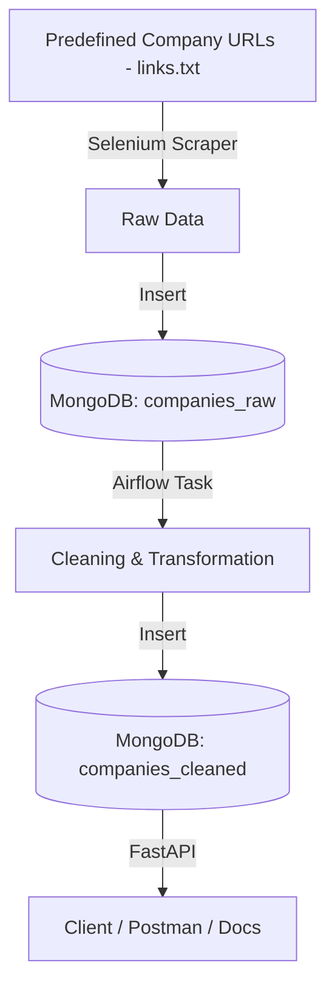

# ⚙️ ZaubaCorp Data Pipeline (Web Scraping · Airflow · MongoDB · FastAPI)

---

## 📘 Project Overview

**ZaubaCorp Data Pipeline** is an end-to-end data engineering project built entirely in **Python**.

The objective of this project is to:

* Scrape 100 company profiles from ZaubaCorp
* Store raw scraped data in MongoDB
* Perform data cleaning and transformation
* Store cleaned data in a separate collection
* Expose cleaned data via a REST API
* Orchestrate the complete workflow using Apache Airflow

This implementation satisfies the requirements defined in the internship assignment fileciteturn0file0.

---

## ⚠️ Important Note About Scraping Strategy

Due to **Cloudflare bot protection** and Selenium limitations on dynamic navigation, the scraper does NOT automatically crawl company listing pages.

Instead:

* 100 company profile URLs were **manually collected**
* These URLs are stored inside:

```
scripts/links.txt
```

If you want to scrape different companies:

1. Open `scripts/links.txt`
2. Replace existing URLs with new company profile links
3. Re-run the Airflow DAG

This ensures stable scraping and avoids bot detection blocks.

---

## 🏗️ Architecture / Workflow

The pipeline follows a structured ETL pattern:

scraping → save raw → cleaning → save cleaned → expose via API



---

## 🧰 Technology Stack

* **Language:** Python
* **Web Scraping:** Selenium
* **Workflow Orchestration:** Apache Airflow
* **Database:** MongoDB Atlas (NoSQL)
* **API Framework:** FastAPI
* **Containerization:** Docker & Docker Compose

---

## 📂 Project Structure

```
ZINTLR-DATA-PIPELINE/
│
├── airflow/
│   ├── dags/
│   │   └── zauba_scraping_cleaning_pipeline.py
│
├── api/
│   ├── main.py
│   ├── db.py
│   ├── schemas.py
│
├── scripts/
│   ├── scraper.py
│   ├── cleaner.py
│   └── links.txt   ← (Manually collected company URLs)
│
├── docker-compose.yml
├── .env
└── README.md
```

---

# 🚀 Setup Instructions (Step-by-Step)

## 1️⃣ Prerequisites

* Docker
* Docker Compose
* MongoDB Atlas Account
* MongoDB Compass (for DB verification)

---

## 2️⃣ MongoDB Atlas Configuration (IMPORTANT)

Before running the project, you MUST allow your local machine IP in MongoDB Atlas.

### ➤ Step 1: Add Database User

1. Go to MongoDB Atlas Dashboard
2. Navigate to:
   **Security → Database Access**
3. Click **Add New Database User**
4. Create username & password
5. Grant **Read and Write to Any Database**
6. Save the user

### ➤ Step 2: Add Your IP Address (MANDATORY)

1. Go to:
   **Security → Network Access**
2. Click **IP Access List**
3. Click **Add IP Address**
4. Click **Add Current IP Address** (or manually enter your public IP)
5. Save

⚠️ If this step is not done, your containers will NOT be able to connect to MongoDB Atlas.

---

## 3️⃣ Clone Repository

```bash
git clone <your-github-repository-url>
cd ZINTLR-DATA-PIPELINE
cd airflow
```

---

## 4️⃣ Configure Environment Variables

Create `.env` file:

```
MONGODB_URI=mongodb+srv://<username>:<password>@cluster.mongodb.net/?retryWrites=true&w=majority
MONGODB_DB=zintlr
```

Replace `<username>` and `<password>` with credentials created in Atlas.

---

## 5️⃣ Start Services

```bash
docker-compose up --build
```

This starts:

* Airflow Webserver (Port 8080)
* Airflow Scheduler
* FastAPI (Port 8000)

---

# 🔁 How to Run Airflow DAG

1. Open: `http://localhost:8080`
2. Login: `admin / admin`
3. Find DAG: `zauba_scraping_cleaning_pipeline`
4. Unpause DAG
5. Click **Trigger DAG**
6. Monitor logs and Graph View

### Task Flow

```
scrape_and_store_raw >> clean_and_store_cleaned
```

---

# 🗄️ How to Verify Data in MongoDB

Use MongoDB Compass.

Database: `zintlr`

### Collection: companies_raw

* Raw scraped records from links.txt

### Collection: companies_cleaned

* Cleaned records
* Deduplicated by CIN
* Date converted to ISO format
* Capital fields converted to numeric

---

# 🌐 How to Run and Test API

### Swagger UI

```
http://localhost:8000/docs
```

---

### POST /company

**Request:**

```json
{
  "cin": "L12345MH2010PLC123456"
}
```

**Success Response:**

```json
{
  "cin": "L12345MH2010PLC123456",
  "name": "ABC PRIVATE LIMITED",
  "company_status": "Active",
  "date_of_incorporation": "2010-05-12T00:00:00",
  "roc": "ROC-Mumbai"
}
```

**Error Response (404):**

```json
{
  "detail": "Company with given CIN not found"
}
```

---

# ⚠️ Assumptions

* CIN uniquely identifies a company
* MongoDB Atlas cluster access is configured correctly
* links.txt contains valid ZaubaCorp company profile URLs

---

# 🚧 Limitations

* No automatic company discovery or pagination
* Company URLs are predefined in `links.txt`
* Scraper may break if website structure changes
* Cloudflare bot protection prevents large-scale automated crawling
* Limited to the manually provided 100 company profiles

---

# 👨‍💻 Author

**A. Yashwanth**
Aspiring Data Engineer | Python
📧 [yashwantharavanti@gmail.com](mailto:yashwantharavanti@gmail.com)
🔗 [https://www.linkedin.com/in/yashwantharavanti](https://www.linkedin.com/in/yashwantharavanti)

---
